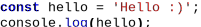

# Syntax highlight example

Syntax highlighting with html or svg generation.

Usage:
```JS
const result = dmSyntax.JS('const hello = \'Hello :)\';\nconsole.log(hello);', dmSyntax.renders.SVG);
```
Value in a constant:
```xml
<svg xmlns="http://www.w3.org/2000/svg" class="js" viewbox="0 0 201 26.6666" width="201px">
    <style>
        text{ font-size: 13.33px; } .js { font-family: "Courier New", monospace; fill: #000; }
        .js .rem{ fill: #A0A0A0; } .js .str{ fill: #AA1515;} .js .re { fill: #FF0000; } 
        .js .kw { fill: #0000FF; font-weight: bold; } .js .num { fill: #005700; font-weight: bold; } 
        .js .func { fill: #0000FF; } .js .gly { font-weight: bold; }
    </style>
    <text y="11.33"><tspan class="kw">const</tspan> hello = <tspan class="str">'Hello :)'</tspan>;</text>
    <text y="26.6633">console.<tspan class="func">log</tspan><tspan class="gly">(</tspan>hello<tspan class="gly">)</tspan>;</text>
</svg>
```

This is what the result will look like:



Syntax is now supported:
* HTML
* JS
* JSON
* CSS
* XML
* CS